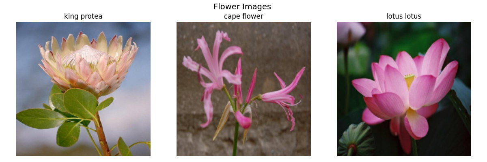
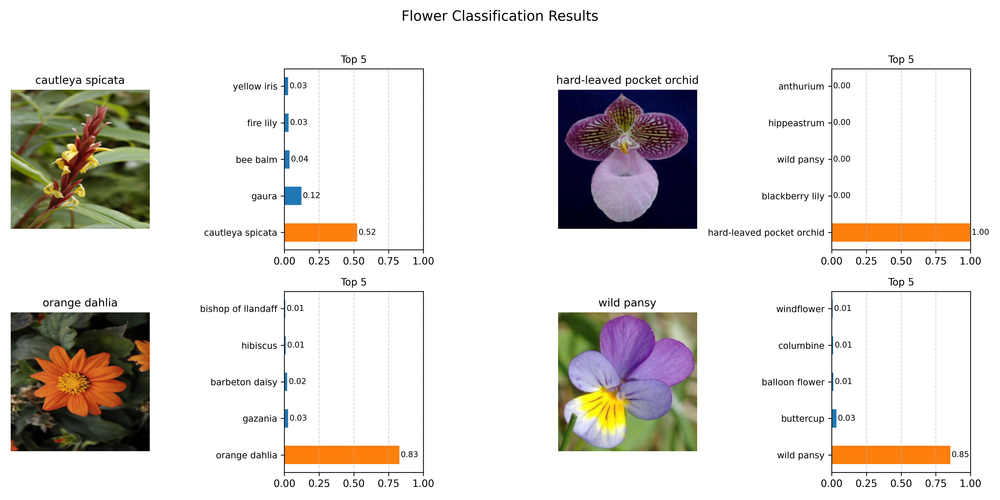

# Flower Image Classification

This project builds an image classification system using a pretrained **MobileNetV2** model to identify different flower categories from images.

The focus is on applying transfer learning to efficiently adapt a pretrained model to a multi class image classification task.

  

### Description

This project develops a multi-class image classification model to identify 102 different flower categories.

The model leverages transfer learning using a pretrained **MobileNetV2** architecture, where the final classification layer is replaced to adapt the network to the target classes. This approach enables efficient training while retaining strong feature representations learned from large scale data.

The model is trained on the [Oxford Flowers 102 dataset](https://docs.pytorch.org/vision/main/generated/torchvision.datasets.Flowers102.html) and is capable of predicting flower classes from unseen images.

## Approach

* Used a pretrained MobileNetV2 model as the feature extractor
* Replaced the final classification layer to match 102 flower classes
* Initially trained only the classifier to leverage pretrained features
* Applied partial fine-tuning on deeper layers to improve performance

### Data

The model is trained on the Oxford Flowers 102 dataset, which contains 102 flower categories with significant variations in scale, pose, and lighting.

* Training samples: 1020
* Validation samples: 1020
* Test samples: 6149

All images are resized to 224 × 224 and normalized to match the input requirements of pretrained MobileNetV2 models.

Normalization values:

* Mean: [0.485, 0.456, 0.406]
* Standard deviation: [0.229, 0.224, 0.225]

## Model

A pretrained MobileNetV2 model, initialized with ImageNet weights, is used as the base architecture.

The final classification layer is replaced to match the 102 target classes. The model is initially trained by freezing the feature extractor and updating only the classifier, followed by partial fine tuning of deeper layers to improve task specific performance.

### Training

* Loss Function: CrossEntropyLoss
* Optimizer: Adam
* Training Strategy: Transfer learning with partial fine-tuning

## Results

  

---

### Reference

Sandler, M., Howard, A., Zhu, M., Zhmoginov, A., & Chen, L. (2018).
*MobileNetV2: Inverted Residuals and Linear Bottlenecks*
https://arxiv.org/abs/1801.04381
